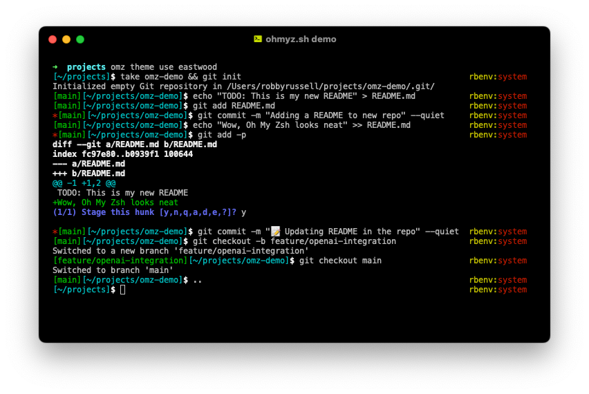
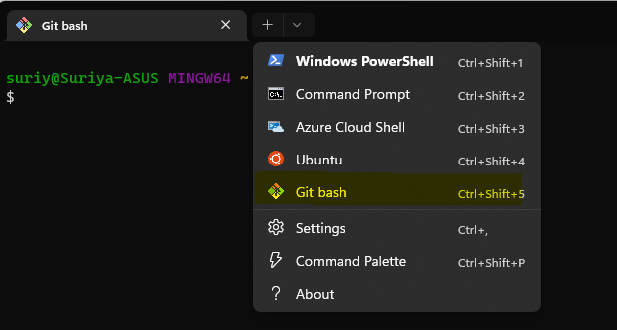

## Make Windows Terminal Awesome with ZSH and Oh My ZSH!

*article photo Photo
by <a href="https://unsplash.com/@andrewtneel?utm_content=creditCopyText&utm_medium=referral&utm_source=unsplash">Andrew
Neel</a>
on <a href="https://unsplash.com/photos/macbook-pro-white-ceramic-mugand-black-smartphone-on-table-cckf4TsHAuw?utm_content=creditCopyText&utm_medium=referral&utm_source=unsplash">
Unsplash</a>*

## TL;DR

In this guide, we'll walk you through the installation and configuration of ZSH and Oh My ZSH on Windows, so you can
enjoy the power and flexibility of these tools without leaving the comfort of your Windows environment.

## Table of Contents

- [Introduction](#introduction)
- [Embracing ZSH on Windows](#embracing-zsh-on-windows)
    - [Introducing ZSH: The Ultimate Shell Experience](#introducing-zsh-the-ultimate-shell-experience)
    - [Oh My ZSH!: ZSH Supercharged](#oh-my-zsh-zsh-supercharged)
- [Step 1: Install Git + Git Bash for Windows](#step-1-install-git--git-bash-for-windows)
- [Step 2: Installation and Configuration of ZSH in Windows](#step-2-installation-and-configuration-of-zsh-in-windows)
    - [2.1: Download ZSH](#21-download-zsh)
    - [2.2: Install ZSH](#22-install-zsh)
    - [2.3: Verify the ZSH Installation](#23-verify-the-zsh-installation)
    - [2.4: Set ZSH as the Default Shell](#24-set-zsh-as-the-default-shell)
    - [2.5: Fix Displaying of Unexpected Characters](#25-fix-displaying-of-unexpected-characters)
- [Step 3: Installation and Configuration of Oh My ZSH! on Windows](#step-3-installation-and-configuration-of-oh-my-zsh-on-windows)
    - [3.1: Installation of Oh My ZSH!](#31-installation-of-oh-my-zsh)
    - [3.2: Customization of Oh My ZSH!](#32-customization-of-oh-my-zsh)
        - [Fonts](#fonts)
        - [Theme](#theme)
- [Conclusion](#conclusion)

## Introduction

Are you tired of the mundane Windows command prompt?

Do you yearn for the powerful Linux terminal, but don't
want to deal with the complexities of `WSL` (Windows Subsystem for Linux)?

Well, rejoice, fellow developers, for there is a solution! With the
combination of:

1. [Git Bash for Windows](https://git-scm.com/downloads)
2. [ZSH](https://www.zsh.org/)
3. [Oh My ZSH!](https://ohmyz.sh/)

you can transform your Windows command line experience into something truly remarkable.

In this guide, we'll walk you through the installation and configuration of ZSH and Oh My ZSH on Windows, so you can
enjoy the power and flexibility of these tools without leaving the comfort of your Windows environment.

## Embracing ZSH on Windows

### Introducing ZSH: The Ultimate Shell Experience


*Image description: ZSH logo.*

`ZSH`, or ***Z Shell***, is a powerful command interpreter for UNIX-like operating systems. It offers advanced features
such as
improved tab completion, spelling correction, and extensive customization options.

### Oh My ZSH!: ZSH Supercharged


*Image description: Oh My ZSH! logo featuring a cute cartoon character with a command prompt.*

But what truly takes ZSH to the next level is Oh My ZSH! This open-source framework for managing ZSH configurations
comes packed with a plethora of themes, plugins, and helpers.

## Step 1: Install Git + Git Bash for Windows

If you haven't already, download and install Git for Windows from the
official website. This will give you access to Git Bash, which serves as the entry point for ZSH. You can find the
Git for Windows installer [here](https://git-scm.com/download/win).

Git Bash is needed so that we also have the `bash` shell available, which is required for ZSH to run, and also for
having the `~/.bashrc` file available.
The `~/.bashrc` file is installed at `C:\Users\<your user name>\.bashrc`.

**IMPORTANT**: Make sure to select the option to use Git from the Windows Command Prompt during the installation.

**ALSO IMPORTANT**: When opening the Windows Terminal app, make sure to select the Git Bash profile as the default
terminal profile! (Select it from the dropdown menu in the top right corner of the terminal window), and then set it as
default in the Settings.


*Image description: Selecting Git Bash as a terminal profile*

## Step 2: Installation and Configuration of ZSH in Windows

Now that we understand the components, let's get down to business. Here's how you can install and configure ZSH and Oh
My ZSH! on your Windows machine without the need for WSL.

### 2.1: Download ZSH

Once Bash for Windows is set up, it is time to install ZSH:
Download the latest MSYS2 zsh package from the MSYS2 package repository. The file will be named
like: `zsh-#.#-#-x86_64.pkg.tar.zst`. You can find the latest version [here](https://packages.msys2.org/package/zsh).

### 2.2: Install ZSH

Extract the contents of the zip file (which will include `etc` and `usr` directories) into your `Git
Bash`
installation directory. This will be in `C:\Program Files\Git`. You should merge the contents of the folder when
asked (
**no files should be getting overridden**).

### 2.3: Verify the ZSH Installation

Open Git Bash and run `zsh --version` to ensure that ZSH is installed correctly.

### 2.4: Set ZSH as the Default Shell

After installation, set ZSH as your default shell by appending the following to
your `C:\Users\<your user name>\.bashrc` file:

   ```bash
   if [ -t 1 ]; then
    exec zsh
   fi
   ```

### 2.5: Fix Displaying of Unexpected Characters

Fix the displaying of garbled characters on terminal by appending this line in
your `C:\Users\<your user name>\.bashrc` file:

   ```bash
   /c/Windows/System32/chcp.com 65001 > /dev/null 2>&1
   ```

Close and reopen the terminal, to save those changes. The first time ZSH will ask for some files creation.

## Step 3: Installation and Configuration of Oh My ZSH! on Windows

As we said earlier, **Oh My ZSH!** is the cherry on top of the **ZSH** cake. Let's see how you can install and configure
it on your Windows machine.

### 3.1: Installation of Oh My ZSH!

**Install Oh My ZSH!**: With ZSH in place, installing Oh My ZSH! is a breeze. Simply run:

```bash
sh -c "$(curl -fsSL https://raw.github.com/ohmyzsh/ohmyzsh/master/tools/install.sh)"
```

### 3.2: Customization of Oh My ZSH!

#### Fonts

Download and install manually
the [Meslo Nerd Fonts](https://github.com/romkatv/powerlevel10k#meslo-nerd-font-patched-for-powerlevel10k) to include
all glyphs and symbols that `Powerlevel10k` may need.

#### Theme

There are a lot of themes, with [Powerlevel10k](https://github.com/romkatv/powerlevel10k) being the most popular and
powerful. To install it, check the
instructions [here](https://github.com/romkatv/powerlevel10k?tab=readme-ov-file#installation).

## Conclusion

Congratulations! You've now unlocked the full potential of ZSH and Oh My ZSH! on Windows. With its advanced features and
endless customization options, ZSH is sure to revolutionize your command line workflow. So why wait? Dive in today and
elevate your development experience like never before.

### SEO Keywords:

1. ZSH Windows installation
2. Oh My ZSH Windows setup
3. Windows command line ZSH
4. ZSH configuration on Windows
5. Bash for Windows ZSH
6. Windows developer tools ZSH
7. ZSH customization Windows
8. Oh My ZSH themes Windows
9. ZSH plugins Windows
10. Windows ZSH tutorial
