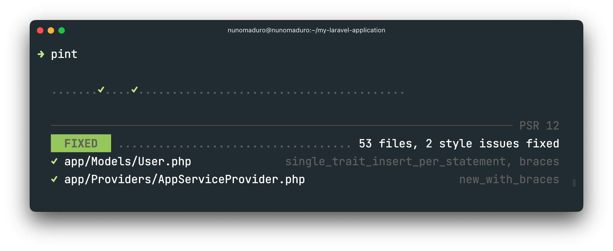

# Mastering Code Quality in Laravel: Pint with Git Hooks and Docker

## Introduction

As developers, we all know how important clean, consistent code is for maintaining a large-scale Laravel application. Not only does well-formatted code boost readability, but it also ensures team-wide consistency and helps avoid pesky formatting debates during code reviews.

Enter [**Pint**](https://laravel.com/docs/11.x/pint), a powerful tool introduced by the Laravel ecosystem to **automatically format PHP code** according to opinionated best practices.

---

In this article, we'll explore how to integrate [Pint](https://laravel.com/docs/11.x/pint) into your Laravel application and take it a step further by running Pint inside a Docker container using **Docker Compose**.

This approach ensures that code formatting is consistent across environments and makes it easier for developers using different setups to maintain uniformity in their codebase.
Let's dive into the details! 🚀



## Why Use Pint in Laravel?

Pint is a zero-configuration tool that formats PHP code following **PHP-CS-Fixer** standards. It comes preconfigured to support modern PHP standards, making it an essential part of any Laravel developer's toolkit.
Automating code formatting helps reduce human errors, eliminates minor formatting discussions in code reviews, and accelerates development workflows by enforcing consistent style across all files. 🥷

**Why is this important?**

1. **Consistency**: Pint ensures your code style is uniform across the team. No more personal preferences affecting how the code looks.
2. **Readability**: Clean code is easier to read and maintain. Pint automatically handles indentation, spacing, and other small details, making your codebase more readable.
3. **Automation**: By integrating Pint in pre-commit Git hooks or running it via Docker, you can automate code formatting, making it one less thing to worry about in your CI pipeline.

---

## Setting Up Pint in a Laravel Application

Let’s walk through the steps of integrating Pint into a Laravel application. For this, we'll use a simple Laravel app as our use case.

### Step 1: Create a New Laravel Application

To get started, let's create a new Laravel project:

```bash
composer create-project --prefer-dist laravel/laravel pint-demo
```

This will create a fresh Laravel project in the `pint-demo` directory.

### Step 2: Install Laravel Pint

You can install Pint as a development dependency by running the following command in your Laravel project:

```bash
composer require laravel/pint --dev
```

This will install Pint in the vendor/bin directory, where you can run it whenever you need to format your code. You can run Pint on your PHP files using the following command:

```bash
./vendor/bin/pint
```

### Step 3: Automating Pint with Husky and Git Hooks

Running Pint manually can become a chore. To automate this, you can set up a pre-commit Git hook to ensure that Pint runs and formats your code every time you make a commit. This guarantees that all committed code is properly formatted.

In order to make sure Pint runs automatically before every Git commit, we can use [Husky](https://www.npmjs.com/package/husky), which is a tool that makes it easy to manage Git hooks in npm-based projects. Here's how to set it up in your Laravel project:

1. **Install Husky:** First, install Husky as a dev dependency:

```bash
npm install husky --save-dev
```

2. **Set up Husky:** Add the following script to your `package.json` to automatically set up Husky during `npm install`:

```json
{
  "scripts": {
    "prepare": "husky install"
  }
}
```

Then, run `npm install` to initialize Husky:

```bash
npm install
```

3. **Create a Pre-commit Hook:** Set up a Git pre-commit hook that runs Pint before every commit:

```bash
npx husky add .husky/pre-commit "vendor/bin/pint"

chmod +x .husky/pre-commit
```

This command creates a `pre-commit` hook in the `.husky` directory that ensures Pint runs whenever a developer attempts to commit code.

---

## Using Pint Inside Docker

In a modern development environment, many teams rely on Docker to ensure consistency across different machines. Running Pint inside Docker ensures that your development environment is identical, regardless of your operating system or local setup.

### Step 4: Setting Up Docker for Pint

You can run Pint inside a Docker container using Docker Compose. Here's how to set it up:

1. First, add a `docker-compose.yml` file to your project if you don’t have one. Here’s an example configuration for a typical Laravel app:

```bash
version: '3.8'

services:
  app:
    image: php:8.1-cli
    volumes:
      - .:/var/www
      - ./vendor:/var/www/vendor
    working_dir: /var/www
    command: bash -c "while true; do sleep 1; done"
```

2. Modify your `pre-commit` hook to run Pint inside the Docker container. Open the `.husky/pre-commit` file and update it as follows:

```bash
# .husky/pre-commit

# Load .env variables from the project root, line by line
if [ -f .env ]; then
    while IFS='=' read -r key value || [ -n "$key" ]; do
        # Skip lines that are comments or do not contain valid key=value format
        if echo "$key" | grep -Eq '^[A-Za-z_][A-Za-z0-9_]*$'; then
            export "$key=$value"
        fi
    done < .env
fi

# Get a list of staged files
STAGED_FILES=$(git diff --cached --name-only --diff-filter=d)

# Separate PHP files from other files, only if there are staged files
if [ -n "$STAGED_FILES" ]; then
    PHP_FILES=$(echo "$STAGED_FILES" | grep '\.php$' || true)
    OTHER_FILES=$(echo "$STAGED_FILES" | grep -v '\.php$' || true)
else
    PHP_FILES=""
    OTHER_FILES=""
fi

# Exit early if there are no files staged (unlikely, but for safety)
if [ -z "$STAGED_FILES" ]; then
    echo "No files staged for commit. Exiting."
    exit 0
fi

# Run Pint for PHP files only
if [ -n "$PHP_FILES" ]; then
    if [ "$USE_DOCKER" = "true" ]; then
        echo "Running Pint in Docker for PHP files..."
        docker compose exec -T php vendor/bin/pint $PHP_FILES
        if [ $? -ne 0 ]; then
            echo "Pint failed while running inside Docker."
            exit 1
        fi
    else
        echo "Running Pint locally for PHP files..."
        vendor/bin/pint $PHP_FILES
        if [ $? -ne 0 ]; then
            echo "Pint failed while running locally."
            exit 1
        fi
    fi

    # Restage PHP files after Pint formatting
    echo "$PHP_FILES" | xargs -r git add
fi

# Restage all non-PHP files
if [ -n "$OTHER_FILES" ]; then
    echo "$OTHER_FILES" | xargs -r git add
fi

echo "Pre-commit hook completed successfully."

exit 0
```

This script checks if the `USE_DOCKER` environment variable (in your Laravel `.env` file) is set to `"true"`. If it is, it runs Pint inside the Docker container. Otherwise, it runs Pint locally. 

This setup gives flexibility to your team, as developers can choose whether they want to run Pint locally or in Docker.

### Step 5: Running Docker Compose

To run Pint in Docker, make sure you have your containers up and running. You can start Docker Compose with:

```bash
docker compose up -d
```

---

## Best Practices for Running Pint in Laravel Applications

Here are a few tips and guidelines for fellow developers working with Pint and Docker:

* **Use Pre-commit Hooks:** Automate Pint formatting with pre-commit hooks to enforce consistency.
* **Use Docker for Consistency:** By running Pint inside a Docker container, you ensure that all team members have the same environment.
* **Customize Pint:** Laravel Pint comes pre-configured, but you can customize its rules by adding a pint.json configuration file if you need to enforce specific styles.
* **Keep Docker Lightweight:** In your `docker-compose.yml` file, mount only the necessary volumes (such as the application and `vendor` directories) to avoid performance issues.

---

## Conclusion

Using Pint in your Laravel application is a simple yet powerful way to ensure consistent code quality and formatting. 

By integrating it with Git hooks, Husky, and Docker, you can automate this process, making it part of your daily development workflow. Whether you run Pint locally or inside a Docker container, it can save time, prevent common formatting errors, and make your codebase cleaner and more maintainable!
